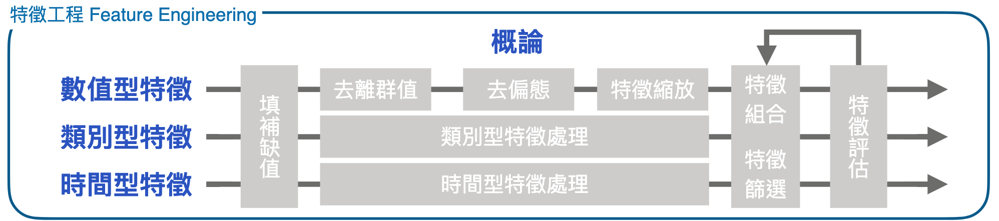
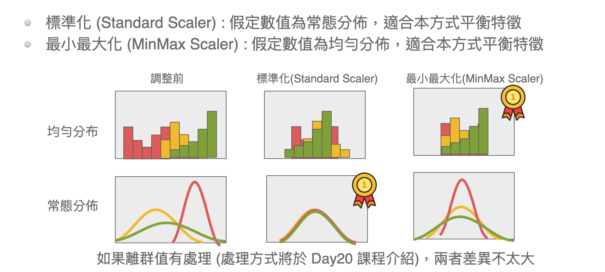

# 2nd-ML100Days

### 一個普通人，在資料科學領域的撞牆筆記

為了讓做這件事情更有趣一點，稍微在每一天的學習過程中做一些可能無關緊要的心得記錄。

##1. 資料清理數據前處理

**2019-4-18** — 作業一，覺得很難，對於資料科學沒什麼感覺，還好有同事一直給我問。

**2019-4-18** — 作業二，假借看展名義把同事拐去咖啡廳，繼續第二天的作業。

**2019-4-18** — 作業三，因為做得很快所以就可以繼續第三天的作業了。

**2019-4-19** — 作業四，剛好在做完前三天作業的當天，第四天～第六天的題目發佈了，在睡前看一下PPT檔案吧！

* 關於label encoder和one hot encoder的不同 [label-encoder-vs-one-hot-encoder](https://medium.com/@contactsunny/label-encoder-vs-one-hot-encoder-in-machine-learning-3fc273365621)
  * 離散的特徵取值之間沒有大小意義那就使用one-hot編碼
  * 離散的特徵取值之間有大小意義可以建立mapping來做數值的映射

**2019-4-19** — 作業五，對於圖形化的方法還要再練習更熟悉，途中碰到各種困難是因為對於畫圖方式的陌生​，語言花越多時間越熟悉，可能前面一段時間(某TED演講是說20小時)都需要稍微撞一下牆:joy:。

**2019-4-19** — 作業六，關於異常值(outliers)的出現原因、檢查流程、處理方法。

**2019-4-20** — 同樣在作業六，稍微看了一下補充資料中關於統計相關的知識點，但是資料處理的程式碼方面還是不夠熟悉，所以又補了一下關於numpy，pandas程式庫的基本概念。折騰了一段時間終於把ecdf(經驗分佈函數)畫出來。

**2019-4-21** — 發現作業六關於[型別判斷的問題](<https://www.cupoy.com/qa/kwassist/ai_tw/0000016A3B608C23000003B66375706F795F72656C656173655155455354>)，並且修改程式碼。有下面兩種寫法。

```python
df.dtypes.isin([np.dtype('int64'),np.dtype('float64')]) 
df.select_dtypes(include=['float64', 'int64'])
```

**2019-4-22** — 作業七比較晚才出來，所以比較晚才能開始做···。第七天作業還算蠻快就做完了，可能是剛進入新的一章節，稍微簡單一點，或是範例比較完整，稍微找到程式碼copy post就好了:joy:。

**2019-4-23** — 作業八在分群畫boxplot圖的時候遇到一些困難，先休息做一下其他事情。發現各種標準化方法，今天用到的是 `z-transform`，數值會有正負。

```python
plt_column = 'AMT_INCOME_TOTAL'
plt_by = ['CNT_CHILDREN_GROUP','TARGET']

app_train.boxplot(column=plt_column, by = plt_by, showfliers = False, figsize=(12,12))
plt.suptitle('')
plt.show()
```

#### 連續值標準化
##### 1. Z-transform: $ \frac{(x - mean(x))}{std(x)} $
##### 2. Range (0 ~ 1): $ \frac{x - min(x)}{max(x) - min(x)} $
##### 3. Range (-1 ~ 1): $ (\frac{x - min(x)}{max(x) - min(x)} - 0.5) * 2 $

**2019-4-23** — 作業九在練習的是熟悉兩個資料之間的相關性，正負相關和無相關性的`scatter圖表`。

```
相關係數`Correlation Coefficient`可以用來了解各個欄位和我們所預測的目標之間的關係指標，衡量兩個隨機變數之間的強度和方向。
```

**2019-4-24** — 訂正作業八錯誤的地方，另外不太理解其中關於`TARGET`這個column的意義。 — 發現`TARGET`是資料為有還款困難的標記，超過X天沒還款。目前從boxplot圖表中看到的還款與否跟收入相關性並不高(小孩少於五的狀況)。

**2019-4-25** — 第十天作業，相關係數的實作和畫圖，Series轉換DataFrame的方法，DataFrame畫成方塊圖等等的技巧和練習。

**2019-4-26** — 第十一天作業，畫圖以及變換圖表樣式，各種語言或是平台的實現方式，以及資料操作和運算手法。

```python
year_group_sorted = pd.unique(age_data.YEARS_BINNED)
```

**2019-4-27** — 作業十二，連續型變數離散化。教一些分切的方式例如`pd.cut`後輸入切成幾份、`pd.qcut`後輸入多少頻率分切亦或是個人化的方式分切。

```python
customized_age_grp = [0,10,20,30,50,100]
ages['customized_age']=pd.cut(ages['age'],bins=customized_age_grp)
ages['customized_age'].value_counts()
```

今天的作業感覺比較簡單(單純?)可能讓我們消化一下前幾天的作業:joy:。

**2019-4-28** — 作業十三，做一些切分和畫圖的處理試著看出裡面的數據有什麼特別的資訊，出現了一些warning不過暫時不會妨礙到程式的運行，查了一下資料打算更了解之後再做處理。

**2019-4-29** — 作業十四，利用sns、plt等作圖庫的加強訓練。感覺還不太熟悉python語法...。

**2019-5-1** — 作業十五，很像進度落後了一點，五一勞動節參加了公司的保齡球和聚餐活動，如果活動太多也是蠻累的呢:joy:。晚上睡醒摸了一陣子開始寫作業，今天的作業算是很順利完成，可能有抓到一些訣竅了XD。

**2019-5-1** — 作業十六，提交第一次model到kaggle，試了幾次因為資料格式不符合被退回，最後下載回來查看了格式如何才成功哈。 

## 2. 資料科學特徵工程技術

**2019-5-4** — 作業十七，認識了特徵值、練習將資料上傳到kaggle取得分數。

**2019-5-4** — 作業十八，認識特徵工程，因為作業十七只是做最簡單暴力的處理，現在要試著進一步認識各種資料類別型態，並且把它做更細緻的分類和分析。



— 特徵工程和特徵的分類表

**2019-5-4** — 作業十九，與到缺失值的填補方式，`指定值`的填補需要建立在`領域知識`之上，或著填補`統計職`(平均、中位數、眾數)或是`預測值`，而標準化需要依照`模型分佈(均勻or常態)`的不同，來做適當的處理。



* 非樹狀模型和樹狀模型對於`標準化`／`最大最小化`後的表現是不同的，`非樹狀模型`**會有影響**(線性迴歸、羅吉斯迴歸、類神經···等)，而`非樹狀模型`**不會有影響**(決策樹、隨機森林、梯度提升樹···等)。
* 嘗試使用不同的`缺值填補方式`和`分析方式`試著尋找出最佳的解。

**2019-5-6** — 作業二十，星期一公佈了作業，趁著今天meeting完比較清閒的感覺趕快做一下，關於離群值的去除。

**2019-5-7** — 作業二十一，關於偏態的修正，有log1p、expm1、boxcox等等方法，需要理解它們的作用順序和方式。

```python
from scipy import stats
from sklearn.preprocessing import MinMaxScaler
from sklearn.model_selection import cross_val_score
from sklearn.linear_model import LogisticRegression
```

**2019-5-10** — 作業二十二，關於LabelEncoder和One-hot編碼，和其對資料分析時間和準確度的影響。

**2019-5-10** — 作業二十三，關於均值編碼的介紹，和可能發生的問題。

* 與目標值明顯相關時再使用均值編碼。
* 非常容易overfitting。
* 平滑化可以修正overfitting的問題但是效果有限。


**2019-5-10** — 作業二十四，計數編碼和雜湊編碼。出現一個cell程式碼順序錯誤的bug，因為不小心按到熱鍵之類的...，以後要小心。

**2019-5-10** — 作業二十五，根據時間，加入週期性特徵，但表現很像沒有比較好。

**2019-5-14** — 作業二十六，計程車的費率預測，加入緯度的實際距離因素後預測結果並沒有變好，可能有什麼其他原因:joy:。

**2019-5-15** — 作業二十七，新增特徵值，做出來的結果並沒有明顯的影響...。

**2019-5-20** — 作業二十八，減少特徵、挑選相關性高的參數，可能要配合之後的課程，目前並不太了解意義。

**2019-5-20** — 作業二十九，特徵搜索、增加組合與評估，和各個函數式的特性。

**2019-5-23** — 作業三十，關於葉編碼，樹之最下層。關於葉編碼和相關的API呼叫，目前非常不熟悉相關參數。

##3. 機械學習基礎模型建立

**2019-5-26** — 作業三十一，[機械學習基礎影片介紹](https://youtu.be/CXgbekl66jc)。各個ML技術的分類和需要用到的地方。

**2019-5-27** — 作業三十二，試著閱讀別人的文章，並且搞清楚別人使用的`專案目標`、`技術`、`資料來源`，做為自己專案的借鏡。

**2019-5-28** — 作業三十三，機械學習在數學上的定義，和基礎三步驟；選擇函數組、定義這個函數有多好、逼進這個函數(Gradient Descent)。

**2019-5-30** — 作業三十四，試著用numpy做陣列操作，並且試著用scikit做資料的切分。

**2019-6-2** — 作業三十五，了解多標籤(multi-label)問題。

**2019-6-2** — 作業三十六，評估指標的種類。

* 回歸問題 — R-square
* 分類問題 — AUC(二分類)、希望某類別不要分錯(F1-score)、top-k accuracy(多分類問題)

**2019-6-3** — 作業三十七，了解線性回歸的發展。

**2019-6-9** — 作業三十八，再複習一次線性迴歸和羅吉斯回歸。資料型態的部分需要做檢查，再送進去。

**2019-6-14** — 作業三十九，LASSO, Ridge Regression的認識，正則化函數的認識；由回歸模型加上不同的正則化函數組成，LASSO 為 Linear Regression 加上 L1 , Redge 為 Linear Regression 加上 L2，超參數α可以調整正則化強度。

**2019-6-15** — 作業四十，利用Linear,LASSO和Ridge實作模型，並且調整α值看結果的變化。

**2019-6-17** — 作業四十一，決策樹和隨機森林的深入說明。